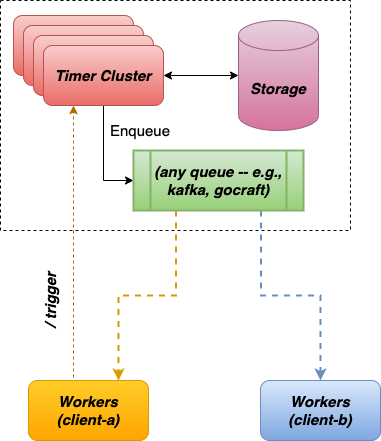

# Clockwork

At the system level, the Clockwork forms a cluster with multiple agent nodes running clockwork binary. All nodes share single
storage (e.g., a Redis cluster).

Whenever schedules are ready as per their definition, one of the agents in the cluster picks up the task of processing
it. The agent will perform necessary pre-checks and then based on configurations from service, client and schedule, it
publishes the execution event to a channel. Workers deployed independently of the scheduler cluster consume these events
to execute any necessary actions.



Clockwork has a flexible architecture which allows configuring different scheduling backends based on requirements.
A `Scheduler` abstraction is used to support this.

## Scheduler

The `Scheduler` implementation has following requirement/responsibilities.

1. Responsible for the persistence of schedule definitions.
2. Should be safe for concurrent and distributed use.
3. Responsible for invoking an OnReadyFunc whenever a `Schedule` is ready.
4. Must provide `at-least-once` semantics.

The scheduler interface described using the Go interface is shown below:

```go
package schedule

// Scheduler is responsible for managing schedule definitions and creating
// execution requests as per the schedules.
type Scheduler interface {
	List(ctx context.Context, offset, count int) ([]Schedule, error)
	Get(ctx context.Context, scheduleID string) (*Schedule, error)
	Put(ctx context.Context, sc Schedule, isUpdate bool, req ...ExecutionRequest) error
	Del(ctx context.Context, scheduleID string) error

	// Run runs the process required to identify schedules ready for execution
	// and invokes onReady for each of them. Run blocks until a critical error
	// occurs or the context is cancelled.
	Run(ctx context.Context, onReady OnReadyFunc) error
}
```

## Implementations

Clockwork currently has 2 implementations of `Scheduler`:

1. In Memory
2. Redis Scheduler

### InMemory Scheduler

InMemory scheduler is implemented using in-memory primitives. It uses a native Go map to store the schedules, and a
simple min-heap to order the execution events.

You can start `clockwork` with in-memory backend using `--backend=in_memory` argument of `clockwork agent` subcommand.

In-Memory scheduler can be used or single-node clockwork deployments with no persistence for schedules. Also, it can be used
during development of Clockwork.

### Redis Scheduler

Redis Scheduler is implemented using Redis (single node or cluster) as the storage backend. It is based on
the [delayq](https://github.com/spy16/delayq) project and uses 2 sorted-sets to implement scheduling.

You can start `clockwork` with Redis backend using `--backend=redis` argument of `clockwork agent` subcommand.

Note: Configurations for Redis scheduler can be provided using configuration file (yaml/json/toml) or 
Environment Variables (e.g., `REDIS_SCHEDULER_ADDR`, `REDIS_SCHEDULER_WORKERS`, etc.).